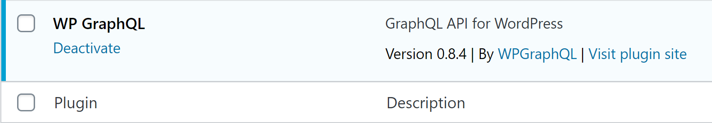

[](https://vercel.com/new/clone?repository-url=https://github.com/hts-central/vercel-v2&project-name=cms-wordpress&repository-name=cms-wordpress&env=WORDPRESS_API_URL&envDescription=Required%20to%20connect%20the%20app%20with%20WordPress&envLink=https://vercel.link/cms-wordpress-env)


### Step 1. Prepare your WordPress site

First, you need a WordPress site. There are many solutions for WordPress hosting, such as [WP Engine](https://wpengine.com/) and [WordPress.com](https://wordpress.com/).

Once the site is ready, you'll need to install the [WPGraphQL](https://www.wpgraphql.com/) plugin. It will add GraphQL API to your WordPress site, which we'll use to query the posts. Follow these steps to install it:

- Download the [WPGraphQL repo](https://github.com/wp-graphql/wp-graphql) as a ZIP archive.
- Inside your WordPress admin, go to **Plugins** and then click **Add New**.


- Click the **Upload Plugin** button at the top of the page and upload the WPGraphQL plugin.


- Once the plugin has been added, activate it from either the **Activate Plugin** button displayed after uploading or from the **Plugins** page.



### Step 2. Set up environment variables

Copy the `.env.local.example` file in this directory to `.env.local` (which will be ignored by Git):

```bash
cp .env.local.example .env.local
```

Then open `.env.local` and set `WORDPRESS_API_URL` to be the URL to your GraphQL endpoint in WordPress. For example: `https://myapp.wpengine.com/graphql`.

Your `.env.local` file should look like this:

```bash
WORDPRESS_API_URL=...

# Only required if you want to enable preview mode
# WORDPRESS_AUTH_REFRESH_TOKEN=
# WORDPRESS_PREVIEW_SECRET=
```
